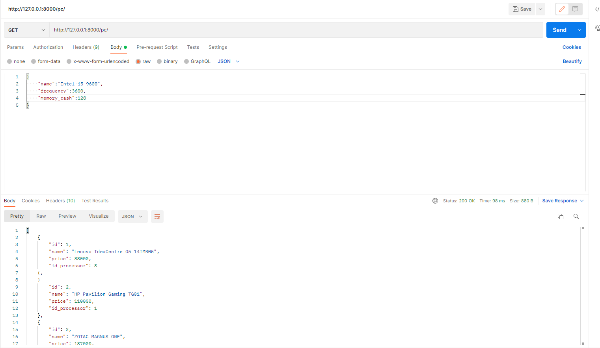
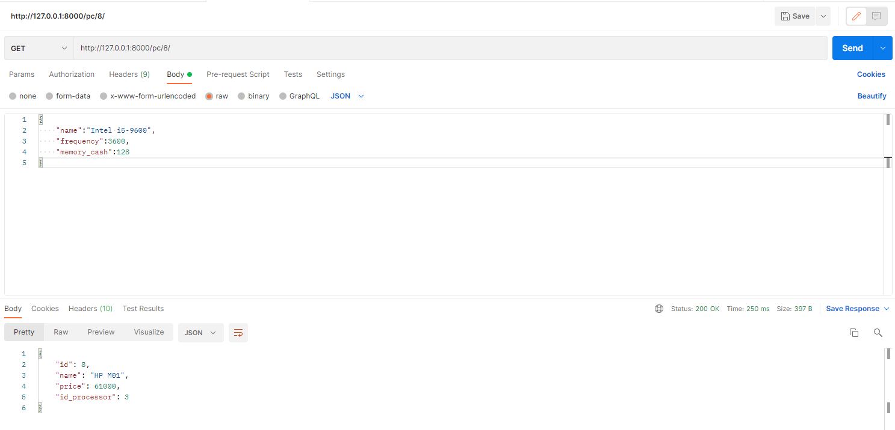
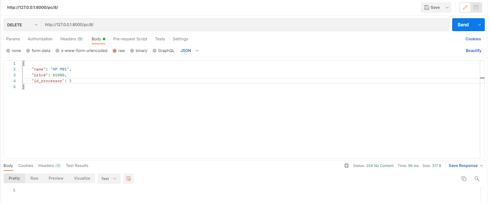
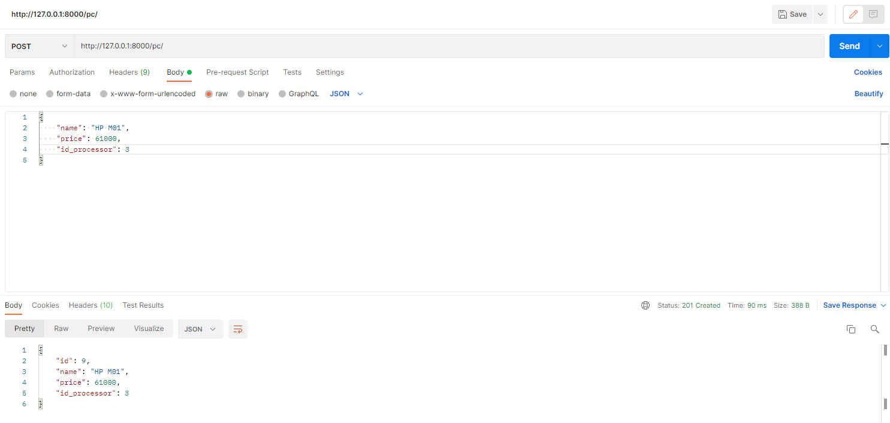
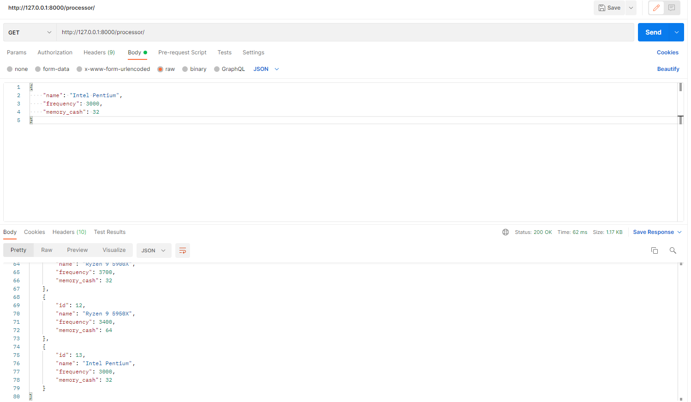
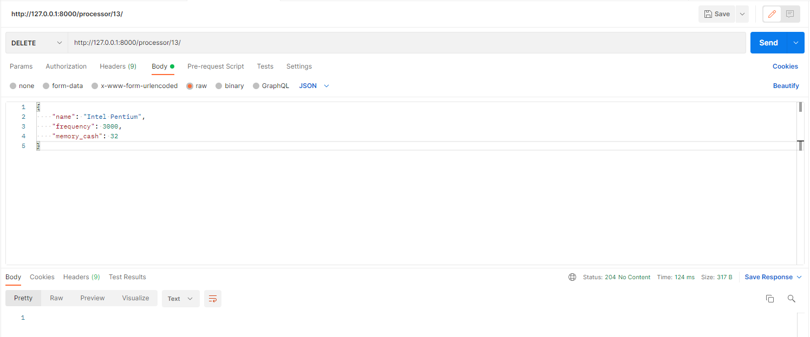
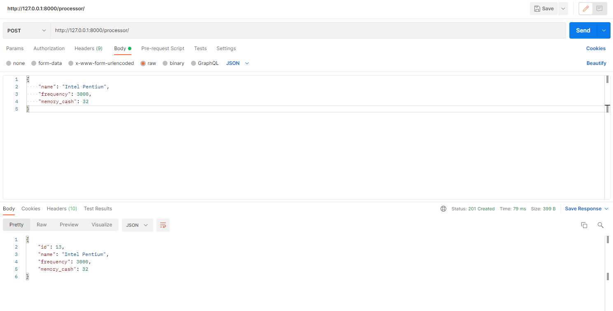
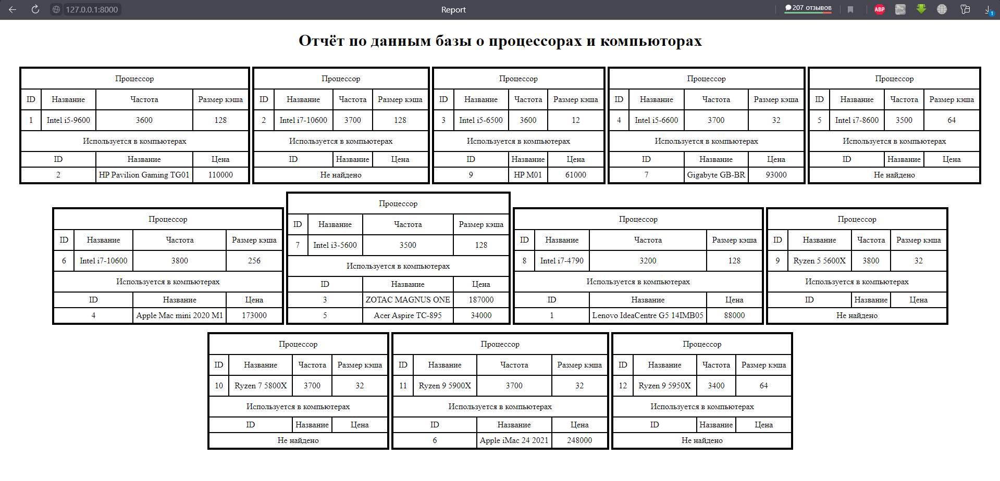

<h1><b>Ветошкин Артём Алексеевич ИУ5-53Б</b></h1>

<h1>Задание:</h1> 
<h2>Вариант В-6.</h2>
<p>
Есть сущности "Процессор" и "Комьютер". <i>Требуется сделать</i>: <br>
<li> Создайте проект Python Django с использованием стандартных средств Django. <br>
<li> Создайте модель Django ORM, содержащую две сущности, связанные отношением один-ко-многим в соответствии с Вашим вариантом из условий рубежного контроля №1. <br>
<li> С использованием стандартного механизма Django сгенерируйте по модели макет веб-приложения, позволяющий добавлять, редактировать и удалять данные. <br>
<li> Создайте представление и шаблон, формирующий отчет, который содержит соединение данных из двух таблиц. <br>

<br>
<h3>Создание моделей и "ручек" для работы с ними</h3>
Создание моделей:

```python
class PCManager(models.Manager):
    def get_pc_by_processor_id(self, id):
        return self.filter(id_processor=id).all()


class Processor(models.Model):
    id = models.AutoField(primary_key=True)
    name = models.CharField(max_length=30, blank=True, null=False)
    frequency = models.IntegerField()
    memory_cash = models.IntegerField()

    class Meta:
        db_table = 'processor'


class PC(models.Model):
    id = models.AutoField(primary_key=True)
    name = models.CharField(max_length=30, blank=True, null=False)
    price = models.IntegerField()
    id_processor = models.ForeignKey('Processor', models.DO_NOTHING, db_column='id_processor', blank=True, null=True)

    objects = PCManager()

    class Meta:
        db_table = 'pc'

```

Для возможности добавления, редактирования и удаления данных были использован rest_framework.

Сотвественно был прописаны сериализаторы:
```python
class PCSerializer(serializers.ModelSerializer):
    class Meta:
        model = models.PC
        fields = ["id", "name", "price", "id_processor"]


class ProcessorSerializer(serializers.ModelSerializer):
    class Meta:
        model = models.Processor
        fields = ["id", "name", "frequency", "memory_cash"]

```
И представления:

```python
class PCViewSet(viewsets.ModelViewSet):
    queryset = models.PC.objects.all()
    serializer_class = serializers.PCSerializer


class ProcessorViewSet(viewsets.ModelViewSet):
    queryset = models.Processor.objects.all()
    serializer_class = serializers.ProcessorSerializer
```

И настроен роутер:


```python
router = routers.DefaultRouter()
router.register('processor', views.ProcessorViewSet)
router.register('pc', views.PCViewSet)
```

<h3> Проверка выполнения запросов на созданные ручик </h3> 

<h4> Для записей о компьютерах </h4> 

Получение всех компьютеров `GET` запросом: 
Получение конкретного компьютера `GET` запросом: 
Удаление конкретного компьютера `DELETE` запросом: 
Создание записи о компьютере `POST` запросом: 

<h4> Для записей о процессорах </h4> 

Получение всех процессоров `GET` запросом: 
Получение конкретного процессора `GET` запросом: 
Удаление конкретного процессора `DELETE` запросом: 
Создание записи о процессоре `POST` запросом: 

<h3>Создание отчёта</h3>

Для показа отчёта было добавленно представление:

```python
def index(request):
    processors = models.Processor.objects.all()
    data = []
    for processor in processors:
        data.append((processor, models.PC.objects.get_pc_by_processor_id(processor.id)))

    return render(request, "index.html", {"data": data})
```

И сверстана страница:

```html
<!DOCTYPE html>
<html lang="ru">
<head>
    <meta charset="UTF-8">
    <title>Report</title>
    <style>
        table.collapse {
            border: 2px solid black;
            border-collapse: collapse;
            margin-top: 10px;
            display: inline-block;
        }

        td.upper {
            border: 2px solid black;
            padding: 10px;
        }

        td {
            border: 2px solid black;
            padding: 5px;
        }

        .center-text {
            text-align: center;
        }
    </style>
</head>
<body>
<h1 class="center-text"> Отчёт по данным базы о процессорах и компьюторах</h1>
<div class="center-text">
    
        <table class="collapse center-text">
            <tr>
                <td class="upper" colspan="12">Процессор</td>
            </tr>
            <tr>
                <td class="upper" colspan="3">ID</td>
                <td class="upper" colspan="3">Название</td>
                <td class="upper" colspan="3">Частота</td>
                <td class="upper" colspan="3">Размер кэша</td>
            </tr>
            <tr>
                <td class="upper" colspan="3">{{ value.0.id }}</td>
                <td class="upper" colspan="3">{{ value.0.name }}</td>
                <td class="upper" colspan="3">{{ value.0.frequency }}</td>
                <td class="upper" colspan="3">{{ value.0.memory_cash }}</td>
            </tr>
            <tr>
                <td class="upper" colspan="12">Используется в компьютерах</td>
            </tr>
            <tr>
                <td colspan="4">ID</td>
                <td colspan="4">Название</td>
                <td colspan="4">Цена</td>
            </tr>
            
                <tr>
                    <td colspan="4">{{ pc.id }}</td>
                    <td colspan="4">{{ pc.name }}</td>
                    <td colspan="4">{{ pc.price }}</td>
                </tr>
            
                <tr>
                    <td colspan="12">Не найдено</td>
                </tr>
            
        </table>
    
</div>
</body>
</html>
```

Для заполнения данных был написан sql скрипт:

```sql
INSERT INTO processor (name, frequency, memory_cash) VALUES
    ('Intel i7-10600', 3700, 128),
    ('Intel i5-6500', 3600, 12),
    ('Intel i5-6600', 3700, 32),
    ('Intel i7-8600', 3500, 64),
    ('Intel i7-10600', 3800, 256),
    ('Intel i3-5600', 3500, 128),
    ('Intel i7-4790', 3200, 128),
    ('Ryzen 5 5600X', 3800, 32),
    ('Ryzen 7 5800X', 3700, 32),
    ('Ryzen 9 5900X', 3700, 32),
    ('Ryzen 9 5950X', 3400, 64);

INSERT INTO PC (name, price, id_processor) VALUES
    ('Lenovo IdeaCentre G5 14IMB05', 88000, 8),
    ('HP Pavilion Gaming TG01', 110000, 1),
    ('ZOTAC MAGNUS ONE', 187000, 7),
    ('Apple Mac mini 2020 M1', 173000, 6),
    ('Acer Aspire TC-895', 34000, 7),
    ('Apple iMac 24 2021', 248000, 11),
    ('Gigabyte GB-BR', 93000, 4),
    ('HP M01', 61000, 3);
```

В итоге получился отчёт следующего вида: 
